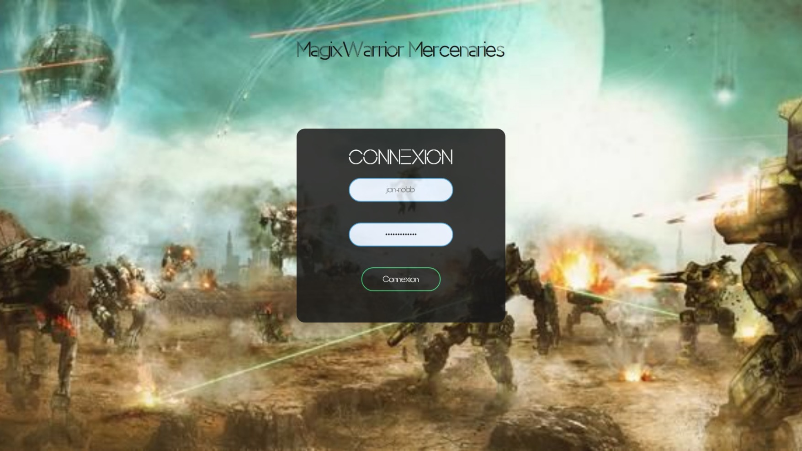
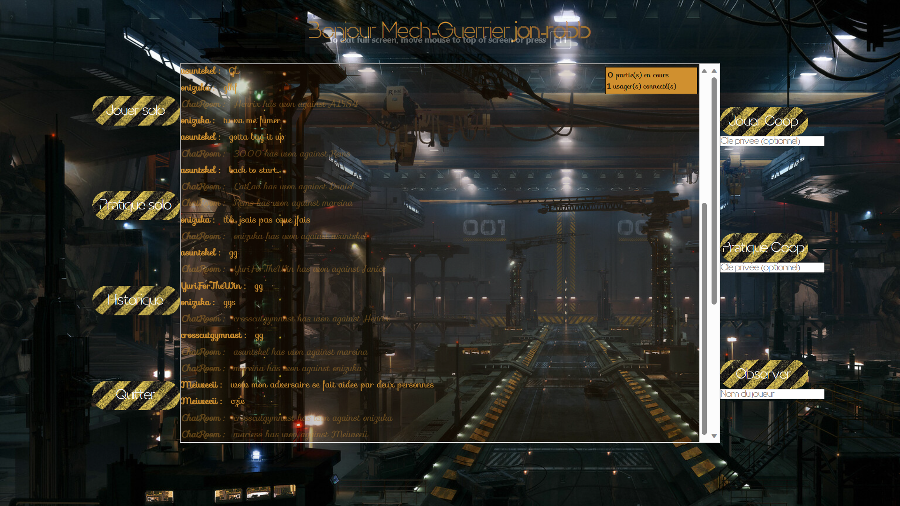
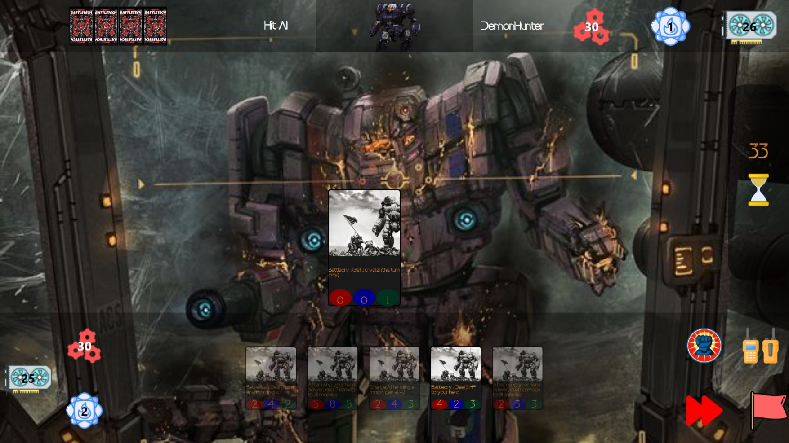

<!-- Improved compatibility of back to top link: See: https://github.com/othneildrew/Best-README-Template/pull/73 -->

<!--
*** Thanks for checking out the Best-README-Template. If you have a suggestion
*** that would make this better, please fork the repo and create a pull request
*** or simply open an issue with the tag "enhancement".
*** Don't forget to give the project a star!
*** Thanks again! Now go create something AMAZING! :D
-->

<!-- PROJECT SHIELDS -->
<!--
*** I'm using markdown "reference style" links for readability.
*** Reference links are enclosed in brackets [ ] instead of parentheses ( ).
*** See the bottom of this document for the declaration of the reference variables
*** for contributors-url, forks-url, etc. This is an optional, concise syntax you may use.
*** https://www.markdownguide.org/basic-syntax/#reference-style-links
-->

<!-- PROJECT LOGO -->

  

 

<h1 align="center">Magix</h1>

  

    A multiplayer card game, akin to Hearthstone, that interfaces with a database and a server's API to retrieve and display the game's current state.tion
  

<!-- TABLE OF CONTENTS -->

  
Table of Contents

  <ol>
    <li>
      <a href="#about-the-project">About The Project</a>
      <ul>
        <li><a href="#built-with">Built With</a></li>
      </ul>
    </li>
    <li><a href="#usage">Usage</a></li>
    <li><a href="#contact">Contact</a></li>
  </ol>

<!-- ABOUT THE PROJECT -->
## About The Project
  

    In this project, I worked on developing a multiplayer card game inspired by popular titles like Hearthstone. The unique aspect was that students could connect to the professor's API, opening up creative opportunities. We used a PHP backend and incorporated AJAX for real-time updates. Students were tasked with designing their local game logic and user interfaces. As the class progressed, we organized an exciting tournament where our custom card games went head-to-head. It was an educational journey that not only improved our technical skills but also created a sense of camaraderie and competition, making it a memorable experience.
  

  

   Since the project's due date, I haven't made any modifications to the code, but I'm proud of the   project nonetheless. It marked my first experience with making API calls and setting up backend components. I'd like to extend my heartfelt thanks to my professor, <a href="https://github.com/ftheriault"> Frederic Theriault</a>, who proved to be one of the most dedicated educators I've encountered. His commitment to our learning was exemplified by his effort in coding an entire game for the benefit of his students.
  

(<a href="#readme-top">back to top</a>)

### Built With

[![VSCode][vscode-img]][vscode-url]
[![HTML5][html5-img]][html5-url]
[![CSS3][css-img]][css-url]
[![JavaScript][javascript-img]][javascript-url]
[![PHP][PHP-img]][PHP-url]
[![PGSQL][PGSQL-img]][PGSQL-url]

(<a href="#readme-top">back to top</a>)

<!-- USAGE EXAMPLES -->
## Usage

  As said previously, the game is not playable for the general public. However, I've included some screenshots to give you an idea of what the game looks like. The game's objective is to reduce your opponent's health to zero. You can do this by playing cards that deal damage to your opponent or by playing cards that heal yourself. The game is turn-based, and each player has a maximum of 10 mana to spend each turn. The game ends when one player's health reaches zero.

<h3>I chose BattleTech as a theme for my game design as I am a fan of the franchise.</h3>
 
<h3> Login Screen </h3>

  

 
<h3> Lobby Screen </h3>

  

 
<h3> Game Board </h3>

  

(<a href="#readme-top">back to top</a>)

<!-- CONTACT -->
## Contact

[![LinkedIn][linkedin-shield]][linkedin-url] 
[![Gmail][gmail-shield]][gmail-url]
[![Portfolio][portfolio-shield]][portfolio-url]

(<a href="#readme-top">back to top</a>)

<!-- MARKDOWN LINKS & IMAGES -->
<!-- https://www.markdownguide.org/basic-syntax/#reference-style-links -->
<!-- images -->
[linkedin-shield]: https://img.shields.io/badge/-LinkedIn-black.svg?style=for-the-badge&logo=linkedin&colorB=555
[linkedin-url]: https://linkedin.com/in/jonathan-robinson-187716274
[gmail-shield]:	https://img.shields.io/badge/Gmail-D14836?style=for-the-badge&logo=gmail&logoColor=white
[portfolio-shield]:https://img.shields.io/badge/website-000000?style=for-the-badge&logo=About.me&logoColor=white
[portfolio-url]: https://jonrobinson.ca

[gmail-url]: mailto:robinsonjonathan240817@gmail.com
[img_ingame]: images\magix_boardpic.jpeg
[img_login]: images\magix_login.jpeg
[img_lobby]: images\magix_lobby.jpeg
[img_logo]: images\magix_logo.jpeg

<!-- built with  -->
[vscode-img]: https://img.shields.io/badge/vs%20code-007ACC?style=for-the-badge&logo=visual-studio-code&logoColor=white
[vscode-url]: https://code.visualstudio.com/
[html5-img]: https://img.shields.io/badge/html5%20-%23E34F26.svg?&style=for-the-badge&logo=html5&logoColor=white
[html5-url]: https://developer.mozilla.org/en-US/docs/Web/Guide/HTML/HTML5
[css-img]: https://img.shields.io/badge/css3%20-%231572B6.svg?&style=for-the-badge&logo=css3&logoColor=white
[css-url]: https://developer.mozilla.org/en-US/docs/Web/CSS
[javascript-img]: https://img.shields.io/badge/javascript%20-%23323330.svg?&style=for-the-badge&logo=javascript&logoColor=%23F7DF1E
[javascript-url]: https://developer.mozilla.org/en-US/docs/Web/JavaScript
[PHP-img]: https://img.shields.io/badge/php-%23777BB4.svg?&style=for-the-badge&logo=php&logoColor=white
[PHP-url]: https://www.php.net/
[PGSQL-img]: https://img.shields.io/badge/postgresql-%23316192.svg?&style=for-the-badge&logo=postgresql&logoColor=white
[PGSQL-url]: https://www.postgresql.org/